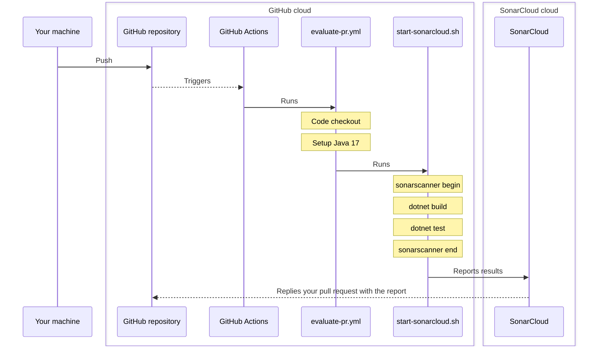

+++
author = "Guilherme Raduenz"
title = "Mermaid"
date = "2024-05-11"
description = "Testing Mermaid diagrams"
tags = [
    "features"
]
+++

Mermaid diagram example.

```mermaid
sequenceDiagram
  participant local as Your machine
  box transparent GitHub cloud
  participant repo as GitHub repository
  participant actions as GitHub Actions
  participant evaluate as evaluate-pr.yml
  participant sonarsh as start-sonarcloud.sh
  end
  box transparent SonarCloud cloud
  participant sc as SonarCloud
  end
  local ->> repo: Push
  repo -->> actions: Triggers
  actions ->> evaluate: Runs
  Note over evaluate: Code checkout
  Note over evaluate: Setup Java 17
  evaluate ->> sonarsh: Runs
  Note over sonarsh: sonarscanner begin
  Note over sonarsh: dotnet build
  Note over sonarsh: dotnet test
  Note over sonarsh: sonarscanner end
  sonarsh ->> sc: Reports results
  sc -->> repo: Replies your pull request with the report
```